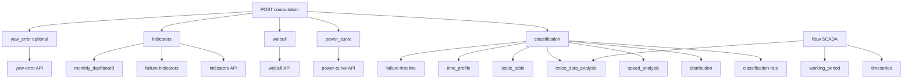

# Chức năng và nhiệm vụ – Phân tích (Analysis)

Tài liệu này mô tả **chức năng analysis** trong SmartWPA: mục đích từng API, tham số chính, nguồn dữ liệu, quan hệ phụ thuộc và đối chiếu với hướng dẫn sử dụng Meteodyn WPA.

---

## 1. Giới thiệu

**Phạm vi:** Chỉ các chức năng **analysis** (API trong `api_gateway.turbines_analysis`). Không bao gồm các API management (users, farms, turbines, SmartHIS, HISPoint, license, auth).

**Tham chiếu:**
- [MUP_WPA_UserManual_en.pdf](MUP_WPA_UserManual_en.pdf) – Hướng dẫn sử dụng Meteodyn WPA
- [SYSTEM_DESIGN_AND_ALGORITHMS.md](SYSTEM_DESIGN_AND_ALGORITHMS.md) – Kiến trúc, DB, thuật toán và API tổng quan
- [QUY_TRINH_TINH_TOAN_COMPUTATION.md](QUY_TRINH_TINH_TOAN_COMPUTATION.md) – Pipeline tính toán và công thức

---

## 2. Bảng chức năng theo API

### 2.1 Cấp turbine

| Endpoint | Method | Mục đích (ngắn) | Tham số chính | Nguồn dữ liệu | Manual |
|----------|--------|-----------------|---------------|---------------|--------|
| `/api/turbines/{id}/computation/` | POST | Chạy pipeline WPA: classification, power curve, weibull, indicators, (yaw_error). Persist kết quả. | `start_time`, `end_time`, `data_source`, `constants` | Raw SCADA (DB/file) | 1.3.5.4.7 |
| `/api/turbines/{id}/classification-rate/` | GET | Tỷ lệ % theo từng trạng thái phân loại. | `start_time`, `end_time` | `computation_type='classification'` | – |
| `/api/turbines/{id}/distribution/` | GET | Phân bố tần suất theo bin (wind_speed hoặc power). | `source_type`, `bin_width`, `bin_count`, `mode`, `time_type`, `start_time`, `end_time` | ClassificationPoint (hoặc raw) | 1.3.6.2.6 |
| `/api/turbines/{id}/indicators/` | GET | KPI: Real/Reachable/Loss energy, TBA, PBA, MTBF, MTTF, MTTR, capacity factor, AEP. | `start_time`, `end_time` | `computation_type='indicators'` | 1.3.6.1 |
| `/api/turbines/{id}/wind-speed-analysis/` | GET | Phân bố tốc độ gió, Weibull A/K, Speed rose (3 mức), Power rose. | `bin_width`, `threshold1`, `threshold2`, `sectors_number`, `mode`, `time_type`, `start_time`, `end_time` | ClassificationPoint + FactoryHistorical | 1.3.6.2.5 |
| `/api/turbines/{id}/static-table/` | GET | Bảng thống kê theo nguồn: Avg, Min, Max, S dev, records, recovery rate, time step. | `source`, `start_time`, `end_time` | ClassificationPoint hoặc FactoryHistorical | 1.3.6.2.8 |
| `/api/turbines/{id}/time-profile/` | GET | Trung bình theo đơn vị thời gian: hourly, daily, monthly, seasonally. | `sources`, `profile`, `start_time`, `end_time` | ClassificationPoint + FactoryHistorical | 1.3.6.2.4 |
| `/api/turbines/{id}/weibull/` | GET | Tham số Weibull (scale A, shape K, mean wind speed). | `start_time`, `end_time` | `computation_type='weibull'` | – |
| `/api/turbines/{id}/power-curve/` | GET | Đường cong công suất (line + scatter). Mode global / time. | `mode`, `time_type`, `start_time`, `end_time`, `max_points` | `computation_type='power_curve'` (+ classification cho scatter) | 1.3.6.2.1 |
| `/api/turbines/{id}/yaw-error/` | GET | Histogram góc yaw + thống kê (mean yaw, std). | `start_time`, `end_time` | `computation_type='yaw_error'` | 1.3.5.3 d |
| `/api/turbines/{id}/timeseries/` | GET | Chuỗi thời gian theo nguồn, raw hoặc resample. | `sources`, `mode`, `start_time`, `end_time` | Raw hoặc classification | 1.3.6.2.3 |
| `/api/turbines/{id}/working-period/` | GET | Chia working period theo biến thiên hiệu suất tháng. | `variation`, `start_time`, `end_time` | Raw + tính performance | 1.3.6.2.2 |
| `/api/turbines/{id}/cross-data-analysis/` | POST | Tương quan X/Y, group, hồi quy (linear, polynomial…). | Body: `x_source`, `y_source`, `group_by`, `regression`, `datetime`, `filters`, `only_computation_data` | Raw / ClassificationPoint | 1.3.6.2.7 |
| `/api/turbines/{id}/dashboard/monthly-analysis/` | GET | Phân tích theo tháng cho 1 turbine (production, indicators). | `start_time`, `end_time`, `variation` | `computation_type='indicators'` + DailyProduction | 1.3.6.1 |

### 2.2 Cấp farm

| Endpoint | Method | Mục đích (ngắn) | Tham số chính | Nguồn dữ liệu | Manual |
|----------|--------|-----------------|---------------|---------------|--------|
| `/api/farms/{id}/indicators/` | GET | Tổng hợp indicators nhiều turbine. | `start_time`, `end_time` | Computation indicators từng turbine | 1.3.5.1 |
| `/api/farms/{id}/weibull/` | GET | Weibull farm (tổng hợp từ turbine). | `start_time`, `end_time` | Computation weibull từng turbine | – |
| `/api/farms/{id}/power-curve/` | GET | Power curve farm (nhiều turbine/period). | `mode`, `time_type`, `start_time`, `end_time`, turbine list | Computation power_curve từng turbine | 1.3.5.3 a |
| `/api/farms/{id}/cross-data-analysis/` | POST | Cross turbine analysis: X/Y, group_by turbine, wind rose (X=wind_direction). | Body giống turbine + `turbine_ids`, `max_points_per_turbine`, `output` | Raw / ClassificationPoint | 1.3.5.3 b |
| `/api/farms/{id}/failure-indicators/` | GET | Biểu đồ cột: số failure, MTTR, MTTF, MTBF theo turbine. | `start_time`, `end_time` | IndicatorData (computation indicators) | 1.3.5.3 c |
| `/api/farms/{id}/failure-timeline/` | GET | Timeline (Gantt) downtime theo turbine. | `start_time`, `end_time` | FailureEvent (computation classification) | 1.3.5.3 c |
| `/api/farms/{id}/dashboard/monthly-analysis/` | GET | Dashboard tháng cấp farm (monthly analysis, production). | `start_time`, `end_time`, `variation` | Computation indicators + DailyProduction | 1.3.5.1 |

---

## 3. Sơ đồ phụ thuộc

- **Computation (POST)** tạo dữ liệu persist. Các API đọc DB phụ thuộc vào computation đã chạy cho cùng time range (hoặc “latest”).
- Một số API có thể dùng **chỉ dữ liệu đã phân loại** (`only_computation_data`) hoặc raw: distribution, speed_analysis, static_table, time_profile, timeseries, cross_data_analysis.

**Ghi chú:**
- API **bắt buộc có computation trước** (đọc từ bảng persist): classification-rate, indicators, weibull, power-curve, yaw-error, failure-indicators, failure-timeline, monthly-dashboard.
- API **có thể dùng raw hoặc classification**: distribution, wind-speed-analysis, static-table, time-profile, timeseries, cross-data-analysis. working-period dùng raw và tính performance.

---

## 4. Mô tả nhiệm vụ từng nhóm

### 4.1 Computation

- **Nhiệm vụ:** Chạy pipeline WPA một lần theo time range: preprocess, classification, power curve, weibull fit, indicators, (yaw_error nếu đủ nguồn). Kết quả được lưu vào DB.
- **Output persist:** `Computation` với các type: `classification` (ClassificationPoint, ClassificationSummary, FailureEvent), `power_curve` (PowerCurveAnalysis, PowerCurveData), `weibull` (WeibullData), `indicators` (IndicatorData, DailyProduction, CapacityFactorData), `yaw_error` (YawErrorData, YawErrorStatistics).
- **Quan hệ:** Tất cả API đọc KPI/curve/classification/failure đều đọc từ các bảng này sau khi computation đã chạy.

### 4.2 Classification và distribution

- **classification-rate:** Trả về tỷ lệ % theo từng `status_code` từ `ClassificationSummary` (Normal, Stop, Curtailment, Under production, …). Dùng cho pie chart hoặc bảng tổng hợp.
- **distribution:** Phân bố tần suất theo bin cho `wind_speed` hoặc `power`; mode global hoặc time (monthly, day_night, seasonally). Dữ liệu từ ClassificationPoint (hoặc raw nếu không dùng only_computation_data).

### 4.3 Power curve và Weibull

- **power-curve (turbine/farm):** Trả về đường cong công suất (line theo bin) và có thể kèm scatter điểm. Mode: global hoặc time (yearly, seasonally, monthly, day_night). Nguồn: PowerCurveAnalysis/PowerCurveData; scatter có thể từ ClassificationPoint.
- **weibull (turbine/farm):** Trả về tham số Weibull (scale A, shape K, mean wind speed) từ WeibullData. Farm tổng hợp từ nhiều turbine.

### 4.4 Indicators và reliability

- **indicators (turbine):** KPI năng lượng (real/reachable/loss, TBA, PBA, capacity factor), reliability (failure_count, MTTR, MTTF, MTBF), AEP. Nguồn: IndicatorData (+ DailyProduction, CapacityFactorData khi cần).
- **indicators (farm):** Tổng hợp từ indicators của từng turbine trong farm.
- **failure-indicators:** Biểu đồ cột theo turbine: số lần failure, MTTR, MTTF, MTBF. Nguồn: IndicatorData.
- **failure-timeline:** Danh sách khoảng downtime (start_time, end_time, duration) theo turbine. Nguồn: FailureEvent (từ computation classification).

### 4.5 Time-based

- **timeseries:** Chuỗi thời gian theo nguồn (power, wind_speed, …), raw hoặc resample (hourly, daily, monthly, seasonally, yearly). Nguồn: raw SCADA hoặc ClassificationPoint.
- **time-profile:** Trung bình theo đơn vị thời gian: hourly (trong ngày), daily (trong năm), monthly, seasonally. Nguồn: ClassificationPoint + FactoryHistorical.
- **working-period:** Chia các “working period” dựa trên biến thiên hiệu suất theo tháng (tham số variation). Nguồn: raw + tính performance theo tháng.

### 4.6 Cross-data và Statistical table

- **cross-data-analysis (turbine):** Tương quan hai trục X/Y (flexible source), nhóm (group by classification, time, hoặc source bins), hồi quy (linear, polynomial, exponential, …). Nguồn: raw hoặc ClassificationPoint (only_computation_data).
- **cross-data-analysis (farm):** Cross turbine analysis: cùng schema + `group_by=turbine`, `turbine_ids`, `max_points_per_turbine`. Khi X=wind_direction trả thêm `wind_rose` (sector aggregation). Nguồn: raw hoặc ClassificationPoint.
- **static-table:** Bảng thống kê theo nguồn: Avg, Min, Max, S dev, số bản ghi, recovery rate, time step. Nguồn: ClassificationPoint hoặc FactoryHistorical.

### 4.7 Dashboard

- **dashboard/monthly-analysis (turbine):** Phân tích theo tháng cho một turbine: production, indicators theo tháng, có thể dùng working period variation. Nguồn: Computation indicators + DailyProduction.
- **dashboard/monthly-analysis (farm):** Tương tự cấp farm: tổng hợp theo tháng cho nhiều turbine, production chart, monthly analysis. Nguồn: computations indicators + DailyProduction của các turbine trong farm.

---

## 5. Đối chiếu với MUP WPA User Manual

| Manual section | Nội dung manual | API SmartWPA | Khớp / Ghi chú |
|----------------|-----------------|--------------|----------------|
| 1.3.5.4.7 Computation | Tính classification, indicators, power curve, … | `POST .../computation/` | Khớp |
| 1.3.6.2.1 Power curve | Phân tích đường cong công suất, scatter có classification, mode Global/Time/Direction | `GET .../power-curve/` | Khớp chức năng. Thiếu: NTF, Direction mode. |
| 1.3.6.2.2 Working periods | Chia period theo biến thiên hiệu suất tháng | `GET .../working-period/` | Khớp |
| 1.3.6.2.3 Time series | Chuỗi thời gian theo nguồn, mode None/Hourly/Daily/… | `GET .../timeseries/` | Khớp |
| 1.3.6.2.4 Time profile | Trung bình theo Hourly/Daily/Monthly/Quarterly | `GET .../time-profile/` | Khớp. Manual có Direction mode; API chưa có. |
| 1.3.6.2.5 Speed analysis | Phân bố tốc độ, Weibull A/K, Speed rose (3 level), Power rose | `GET .../wind-speed-analysis/` | Khớp |
| 1.3.6.2.6 Distribution | Phân bố tần suất, wind rose, average per sector | `GET .../distribution/` | Khớp (wind_speed/power). Manual có Direction mode; API chưa có. |
| 1.3.6.2.7 Cross data analysis | Tương quan X/Y, group, regression (R, R²) | `POST .../cross-data-analysis/` (turbine + farm) | Khớp. Farm: `POST /api/farms/{id}/cross-data-analysis/`, group_by=turbine, wind rose. |
| 1.3.6.2.8 Statistical table | Bảng thống kê: Avg, Min, Max, S dev, records, recovery, time step | `GET .../static-table/` | Khớp |
| 1.3.6.1 Dashboard (turbine) | Indicators + monthly chart | indicators + `.../dashboard/monthly-analysis/` | Khớp |
| 1.3.5.1 Dashboard (farm) | Indicators + Monthly analysis, production chart | farm indicators + `.../dashboard/monthly-analysis/` | Khớp |
| 1.3.5.3 c Failure analysis | Timeline + histogram (failures, MTTR, MTTF, MTBF) | `failure-timeline/` + `failure-indicators/` | Khớp |
| 1.3.5.3 d Yaw analysis | Yaw misalignment, histogram | `GET .../yaw-error/` | Khớp (turbine). Manual có farm-level; API chỉ turbine. |

### 5.1 Khác biệt so với manual

- **Direction mode (split theo sector hướng gió):** Manual có ở Power curve, Time profile, Distribution, Speed analysis. Hiện code chỉ có time split (monthly, day_night, seasonally/yearly), chưa có direction subset.
- **Cross turbine analysis (farm):** Đã có endpoint farm cross-data-analysis (group_by=turbine, wind rose khi X=wind_direction).
- **NTF (Nacelle Transfer Function):** Manual mô tả power curve with NTF (corrected wind speed). SmartWPA hiện chưa hỗ trợ NTF trong API power curve.
- **Yaw analysis farm-level:** Manual có thể hiển thị yaw cho nhiều turbine; API yaw-error chỉ theo turbine.

---

## 6. Quy ước response và lỗi

Theo [SYSTEM_DESIGN_AND_ALGORITHMS.md](SYSTEM_DESIGN_AND_ALGORITHMS.md) mục 6:

- **Success:** `{ "success": true, "data": {...} }`
- **Error:** `{ "success": false, "error": "message", "code": "ERROR_CODE" }`

Mã lỗi thường dùng: `MISSING_PARAMETERS`, `INVALID_PARAMETERS`, `NO_RESULT_FOUND` / `NO_DATA`, `ACCESS_DENIED`, `INTERNAL_SERVER_ERROR`, `TURBINE_NOT_FOUND`, `FARM_NOT_FOUND`, `NO_CLASSIFICATION`, `NO_INDICATORS`, `NO_WEIBULL`, `NO_YAW_ERROR`, `NO_DATA_FOUND`.
