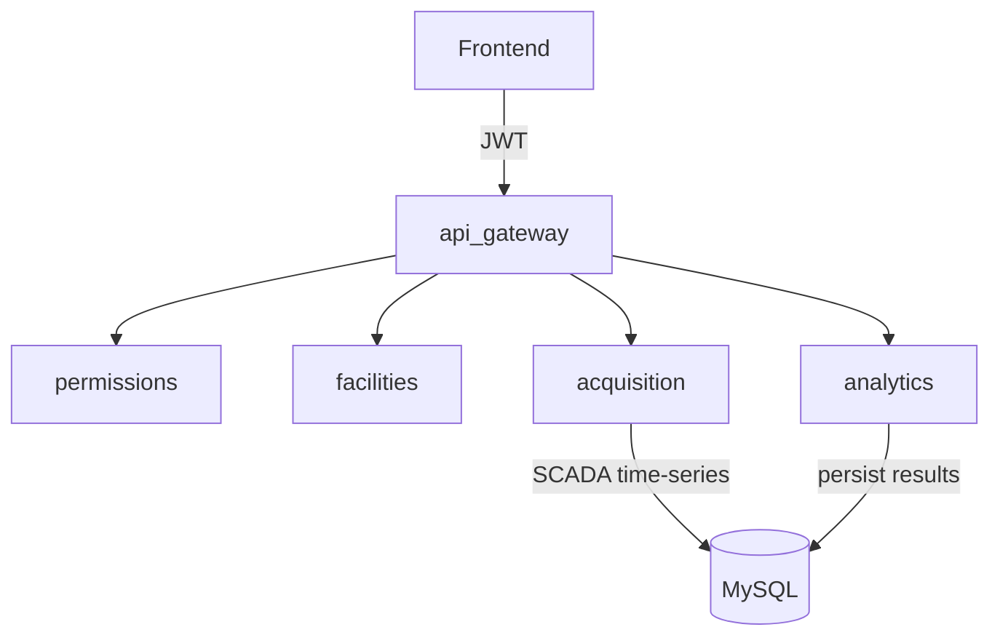
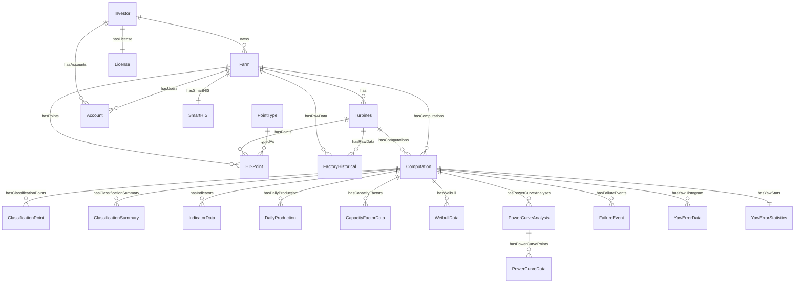
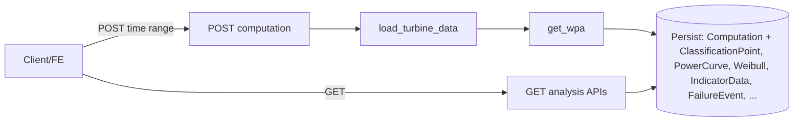

# Thiết kế hệ thống, DB & thuật toán (SmartWPA)

Tài liệu này mô tả kiến trúc backend, **thiết kế DB**, data model chính, và các thuật toán cốt lõi trong SmartWPA.

---

## 1) Kiến trúc tổng quan

SmartWPA là **Django REST backend** gồm các app:

- `permissions/`: user/role/license + permission rules
- `facilities/`: investor/farm/turbine
- `acquisition/`: lấy dữ liệu (SmartHIS, Modbus, Influx) và lưu time-series
- `analytics/`: core compute + persist kết quả phân tích (DB)
- `api_gateway/`: public REST APIs (CRUD + analysis endpoints)

---

## 2) Data models chính (rút gọn)

### 2.1 Facilities

- `facilities.Investor` 1—N `facilities.Farm` 1—N `facilities.Turbines`

### 2.2 Acquisition (time-series)

- `acquisition.FactoryHistorical`: time-series SCADA cho turbine (wind_speed, active_power, wind_dir, temp, pressure, humidity...)

### 2.3 Analytics (persist kết quả WPA)

- `analytics.Computation`: metadata theo `(turbine, farm, computation_type, start_time(ms), end_time(ms))` + constants ước lượng (`v_cutin/v_cutout/v_rated/p_rated`)
- `analytics.ClassificationPoint`: điểm (timestamp(ms), wind_speed, active_power, classification)
- `analytics.ClassificationSummary`: % theo status_code
- `analytics.PowerCurveAnalysis` + `analytics.PowerCurveData`: đường cong power curve theo mode
- `analytics.IndicatorData`: KPI năng lượng + reliability + yaw + AEP
- `analytics.DailyProduction`, `analytics.CapacityFactorData`, `analytics.WeibullData`
- `analytics.FailureEvent`: intervals downtime derive từ classification

---

## 3) Thiết kế DB + ERD + nhận xét (gộp từ `DB_SCHEMA_AND_REVIEW.md`)

Phần này mô tả schema DB hiện tại (theo Django models), vẽ ERD (mermaid), và nhận xét DB đã tổ chức hợp lý chưa theo các tiêu chí: **tính nhất quán, query pattern, index/constraints, và khả năng scale**.

Nguồn schema:
- `facilities/models.py`
- `permissions/models.py`
- `acquisition/models.py`
- `analytics/models.py`

### 3.1 Tổng quan lớp dữ liệu

SmartWPA hiện có 2 lớp lưu trữ chính:

- **Raw SCADA time-series**: `acquisition.FactoryHistorical`
- **Computed/persist results**: `analytics.Computation` + các bảng con (classification, indicators, power curve, weibull, yaw, failure events…)

### 3.2 ERD (hiện trạng, rút gọn)

Ghi chú:
- ERD trên **rút gọn** để dễ đọc. Các entity/field đầy đủ nằm trong Django models.

### 3.2.1 Core tables (chi tiết fields + constraints/index — theo models)

#### A) `facilities` (master data)

- **`facilities.Investor`**
  - Fields chính: `name (unique)`, `email (unique)`, `is_active`, `created_at`
  - Quan hệ:
    - 1—N `Farm` (FK `Farm.investor`)
    - 1—N `Account` (FK `Account.investor_profile`)
    - 1—1 `License` (OneToOne `License.investor`)
- **`facilities.Farm`**
  - Fields chính: `name (unique)`, `address`, `capacity`, `latitude`, `longitude`, `investor_id`, `time_created`
  - Quan hệ:
    - 1—N `Turbines` (FK `Turbines.farm`)
    - 1—N raw SCADA `FactoryHistorical` (FK `FactoryHistorical.farm`)
- **`facilities.Turbines`**
  - Fields chính: `name (unique)`, `farm_id`, `capacity`, `latitude`, `longitude`, `is_active`, `last_data_update`

#### B) `permissions` (user/license)

- **`permissions.Account`**
  - Fields chính: `email (unique)`, `username (unique)`, `role`, `investor_profile_id (nullable)`, `farm_id (nullable)`, `manager_id (nullable)`
  - Ràng buộc logic (validation ở `clean()`):
    - role `investor` ⇒ phải có `investor_profile`
    - role `farm_admin/staff` ⇒ phải có `farm`
- **`permissions.License`**
  - OneToOne với `Investor`
  - Fields chính: `key (unique)`, `is_permanent`, `expiry_date`

#### C) `acquisition` (raw SCADA time-series)

- **`acquisition.FactoryHistorical`**
  - Key: `(farm_id, turbine_id, time_stamp)` với `unique_together`
  - Fields chính:
    - `time_stamp` (datetime)
    - `wind_speed` (m/s)
    - `active_power` (**metadata hiện ghi MW**, cần chuẩn hoá với compute)
    - `wind_dir`, `air_temp`, `pressure`, `hud`
  - Indexes (đã có):
    - `(farm_id, turbine_id, time_stamp)`
    - `(farm_id, time_stamp)`
  - Lưu ý schema/unit rất quan trọng:
    - compute đang kỳ vọng `PRESSURE` là **Pa**, `HUMIDITY` là **0..1**, `TEMPERATURE` là **K** (xem `docs/KPI_FORMULAS_AND_UNITS.md` mục 10).

#### D) `analytics` (computed/persist)

- **`analytics.Computation`**
  - Key logic: 1 computation gắn với 1 `turbine_id`, 1 `farm_id`, 1 `computation_type`, 1 time range (`start_time`, `end_time` — **ms**)
  - Fields chính:
    - `start_time` (ms), `end_time` (ms), `computation_type`, `created_at`, `is_latest`
    - constants ước lượng: `v_cutin/v_cutout/v_rated/p_rated`
  - Indexes (đã có, theo `analytics/models.py`):
    - `(turbine, computation_type, -start_time)`
    - `(turbine, computation_type, -end_time)`
    - `(farm, computation_type, -start_time)`
    - `(turbine, computation_type, is_latest)`
  - Constraint quan trọng:
    - unique `('turbine','computation_type','start_time','end_time','is_latest')` để đảm bảo “latest theo range” chỉ có 1 record.
- **`analytics.ClassificationPoint`**
  - Fields chính: `timestamp (ms)`, `wind_speed`, `active_power`, `classification` (int code)
  - Indexes:
    - `(computation_id, timestamp)`
    - `(computation_id, classification)`
- **`analytics.ClassificationSummary`**
  - Fields chính: `status_code`, `status_name`, `count`, `percentage`
  - Constraint:
    - `unique_together (computation_id, status_code)`
  - Index:
    - `(computation_id, status_code)`
- **`analytics.IndicatorData`**
  - FK: `computation_id`
  - Field groups (rất nhiều):
    - energy KPIs: `average_wind_speed`, `reachable_energy`, `real_energy`, `loss_energy`, `loss_percent`, `rated_power`, `tba`, `pba`
    - losses: `stop_loss`, `partial_stop_loss`, `under_production_loss`, `curtailment_loss`, `partial_curtailment_loss`
    - reliability: `failure_count`, `mttr`, `mttf`, `mtbf` (seconds)
    - AEP Rayleigh/Weibull, yaw_misalignment, durations…
  - Index:
    - `(computation_id)`
- **`analytics.PowerCurveAnalysis` / `analytics.PowerCurveData`**
  - `PowerCurveAnalysis`: `(computation_id, analysis_mode, split_value, data_source, min_value, max_value)`
  - `PowerCurveData`: `(analysis_id, wind_speed, active_power)`; order theo `wind_speed`
- **`analytics.WeibullData`**
  - `(computation_id, scale_parameter_a, shape_parameter_k, mean_wind_speed)`
- **`analytics.DailyProduction`**
  - `(computation_id, date, daily_production)` với `unique_together (computation_id, date)` và index `(computation_id, date)`
- **`analytics.CapacityFactorData`**
  - `(computation_id, wind_speed_bin, capacity_factor)` với `unique_together (computation_id, wind_speed_bin)`
- **`analytics.FailureEvent`**
  - FK: `computation_id` (classification computation cùng time range)
  - Fields: `start_time` (ms), `end_time` (ms), `duration_s` (seconds), `status`
  - Indexes:
    - `(computation_id, start_time)`
    - `(computation_id, end_time)`

### 3.3 Query patterns chính (thực tế API đang dùng)

#### 3.3.1 Raw time-series
- Load theo turbine + time range:
  - `(turbine_id, time_stamp)` là key truy vấn chủ đạo
  - Model hiện có index `['farm','turbine','time_stamp']` và `['farm','time_stamp']`

#### 3.3.2 Computation results
- Lấy “latest” theo turbine và computation_type:
  - filter: `turbine_id`, `computation_type`, `is_latest=True`
  - sort: `-end_time`, `-created_at`
- Khi có filter time-range:
  - nhiều endpoint hiện dùng `start_time=end_time=...` (exact match)

#### 3.3.3 Farm-level aggregation
- Farm monthly dashboard: aggregate `DailyProduction` theo `TruncMonth(date)` (bulk)
- **Failure indicators và timeline**: đọc từ dữ liệu đã persist — **IndicatorData** (cho failure_count, mttr, mttf, mtbf) và **FailureEvent** (cho danh sách downtime intervals). Failure charts: pick 1 computation per turbine rồi bulk load `FailureEvent` và `IndicatorData`.

### 3.4 Nhận xét “DB đã tổ chức hợp lý chưa?”

#### 3.4.1 Điểm hợp lý
- **Tách raw vs computed** rõ ràng (traceability tốt).
- **Persist đủ cho UI** (KPI, timeline, curve lines…).
- **Index cơ bản** cho các truy vấn phổ biến.

#### 3.4.2 Điểm chưa hợp lý / rủi ro
- **Mismatch đơn vị trong raw schema** (rất quan trọng):
  - `FactoryHistorical.pressure` đang mô tả “%” nhưng compute lọc theo **Pa** (50k..108.5k).
  - `FactoryHistorical.active_power` mô tả “MW” nhưng nhiều logic/docs mặc định kW.
- **FK `DO_NOTHING` trong `FactoryHistorical`**: có thể tạo orphan rows nếu farm/turbine bị xoá.
- **Sensitive info**: `SmartHIS.password` plain text → cần secret store/encryption.
- **Computation versioning**: thiếu `algorithm_version`/`code_hash` → khó truy vết khi thuật toán đổi.
- **Keep-forever scale**: raw + `ClassificationPoint` phình nhanh (10-min × turbines × years).

### 3.5 Đề xuất nâng cấp schema (không phá vỡ backward-compat)

#### 3.5.1 Chuẩn hoá đơn vị (P0)
- Chọn canonical units và enforce ở ingestion/mapping (pressure Pa, humidity 0..1, temperature K, power kW hoặc MW nhưng thống nhất).

#### 3.5.2 Bổ sung versioning cho Computation (P1)
Thêm field cho `analytics.Computation`:
- `algorithm_version` (string)
- `code_hash` hoặc `git_commit` (string)
- `input_schema_version` (string)

#### 3.5.3 Materialized tables cho “query-only APIs” (P1/P2)
- `WpaComputedPoint` (denormalized) cho cross-data
- `WpaMonthlyAgg` / `WpaFarmMonthlyAgg` cho dashboard

#### 3.5.4 Partitioning / sharding (khi data lớn)
- Partition `FactoryHistorical` theo month/year
- Partition `ClassificationPoint` theo `computation_id` hoặc time bucket

---

## 4) Thuật toán (core compute)

Entry-point: `analytics/computation/smartWPA.py:get_wpa()`

### 4.1 Preprocess & chuẩn hóa

- Chuẩn timestamp + resample 10 phút
- Làm sạch met (T/H/P) + impute (KNN)
- Tính air density và normalize về \(\rho_0=1.225\)

### 4.2 Classification (gán nhãn)

Xem chi tiết trong `docs/QUY_TRINH_TINH_TOAN_COMPUTATION.md` (mục 5 + phụ lục A). Định nghĩa trạng thái và đối chiếu với IEC 61400-12-1 (data rejection) + IEC TS 61400-26 (availability): mục 5.0 và Phụ lục B.

Mục tiêu:
- Derive status từ SCADA (không dùng status code turbine)
- Tạo “healthy curve” và phân lớp normal/under/over + curtailment + stop

### 4.3 Power curve

- Binning wind speed
- Mean power theo bin cho:
  - global
  - yearly / quarterly / monthly
  - day/night

Persist vào `PowerCurveAnalysis/PowerCurveData`.

### 4.4 Weibull + AEP (Rayleigh/Weibull)

- Fit Weibull cho wind speed subset NORMAL
- Integrate AEP theo bins (trapz). Công thức Rayleigh/Weibull và mapping IEC 61400-12-1 Clause 9.3: `docs/QUY_TRINH_TINH_TOAN_COMPUTATION.md` mục 14 và Phụ lục B.

### 4.5 Indicators

Gồm:
- Energy indicators (ReachableEnergy, RealEnergy, LossEnergy, LossPercent, TBA/PBA…)
- Reliability indicators (FailureCount, MTTR, MTTF, MTBF)
- Yaw histogram (nếu đủ source)

### 4.6 Reliability / Failure events

Xem chi tiết trong `docs/KPI_FORMULAS_AND_UNITS.md` (mục 6.5–6.10).

---

## 5) Thiết kế API (nhóm turbines_analysis)

Triết lý:
- Computation chạy 1 lần theo time-range → persist
- Các API phân tích chủ yếu đọc DB và return payload cho FE

### 5.1 Danh sách API analysis và mục đích

**Turbine-level (prefix `/api/turbines/{id}/`):**

| Endpoint | Mục đích (tóm tắt) | Data source |
|----------|---------------------|-------------|
| `POST computation/` | Chạy WPA pipeline, persist kết quả | Raw SCADA |
| `GET classification-rate/` | Tỷ lệ % theo trạng thái phân loại | classification |
| `GET distribution/` | Phân bố tần suất (wind_speed/power) | ClassificationPoint / raw |
| `GET indicators/` | KPI năng lượng, reliability, AEP | indicators |
| `GET wind-speed-analysis/` | Phân bố tốc độ, Weibull A/K, Speed/Power rose | ClassificationPoint + raw |
| `GET static-table/` | Bảng thống kê theo nguồn | ClassificationPoint / raw |
| `GET time-profile/` | Trung bình theo hourly/daily/monthly/seasonally | ClassificationPoint + raw |
| `GET weibull/` | Tham số Weibull (A, K, mean) | weibull |
| `GET power-curve/` | Đường cong công suất (line + scatter) | power_curve + classification |
| `GET yaw-error/` | Histogram yaw + thống kê | yaw_error |
| `GET timeseries/` | Chuỗi thời gian (raw hoặc resample) | Raw / classification |
| `GET working-period/` | Working period theo biến thiên hiệu suất tháng | Raw |
| `POST cross-data-analysis/` | Tương quan X/Y, group, regression | Raw / ClassificationPoint |
| `GET dashboard/monthly-analysis/` | Phân tích theo tháng (1 turbine) | indicators + DailyProduction |

**Farm-level (prefix `/api/farms/{id}/`):**

| Endpoint | Mục đích (tóm tắt) | Data source |
|----------|---------------------|-------------|
| `GET indicators/` | Tổng hợp indicators nhiều turbine | indicators (từng turbine) |
| `GET weibull/` | Weibull farm (tổng hợp) | weibull (từng turbine) |
| `GET power-curve/` | Power curve farm (nhiều turbine) | power_curve (từng turbine) |
| `POST cross-data-analysis/` | Cross turbine analysis: X/Y, group_by turbine, wind rose (X=wind_direction) | Raw / ClassificationPoint |
| `GET failure-indicators/` | Biểu đồ cột: failures, MTTR, MTTF, MTBF | IndicatorData |
| `GET failure-timeline/` | Timeline downtime (Gantt) | FailureEvent |
| `GET dashboard/monthly-analysis/` | Dashboard tháng cấp farm | indicators + DailyProduction |

Chi tiết từng chức năng, tham số và nhiệm vụ xem [ANALYSIS_FUNCTIONS_AND_RESPONSIBILITIES.md](ANALYSIS_FUNCTIONS_AND_RESPONSIBILITIES.md).

### 5.2 Luồng dữ liệu analysis

Computation chạy một lần theo time range và ghi kết quả vào DB. Các API phân tích (classification-rate, indicators, power-curve, weibull, yaw-error, failure-*, monthly-dashboard, …) đọc từ các bảng đã persist và trả payload cho FE.

### 5.3 Đối chiếu với MUP WPA User Manual

SmartWPA analysis APIs được thiết kế theo hướng dẫn Meteodyn WPA (MUP_WPA_UserManual_en.pdf): mục 1.3.6.2 (turbine analysis) và 1.3.5 (farm: dashboard, data analysis, computation). Phần lớn chức năng khớp công dụng với manual.

Các điểm chưa implement so với manual:
- **Direction mode:** split theo sector hướng gió (manual có ở Power curve, Time profile, Distribution, Speed analysis); code chỉ có time split (monthly, day_night, seasonally/yearly).
- **Cross turbine analysis (farm):** đã có `POST /api/farms/{id}/cross-data-analysis/` (group_by=turbine, wind rose khi X=wind_direction).
- **NTF (Nacelle Transfer Function):** power curve với wind speed đã hiệu chỉnh NTF; chưa hỗ trợ trong API.

---

## 6) Error handling & response conventions

Chuẩn response thường dùng:

- Success:
  - `{ "success": true, "data": {...} }`
- Error:
  - `{ "success": false, "error": "message", "code": "ERROR_CODE" }`

Code phổ biến:
- `MISSING_PARAMETERS`
- `INVALID_PARAMETERS`
- `NO_RESULT_FOUND` / `NO_DATA`
- `ACCESS_DENIED`
- `INTERNAL_SERVER_ERROR`

